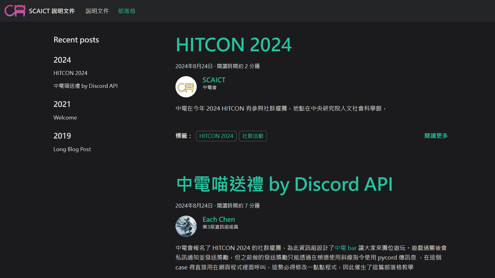
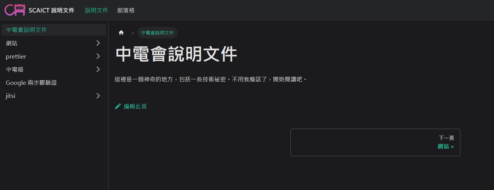

# 中電會 第3屆專案開發說明文件

> start at 7/26/2024

為了不要被第4屆罵說第3屆學長伺服器設後不理，撰寫了這份說明文件。
目前網站內有兩大主題：
## Document
有關中電會的大小專案使用方法和維護須知


## Blog
研究成果、教學和大事記


## 本地開發

### Installation

```
$ yarn
```

### Local Development

```
$ yarn start
```

This command starts a local development server and opens up a browser window. Most changes are reflected live without having to restart the server.

### Build

```
$ yarn build
```

This command generates static content into the `build` directory and can be served using any static contents hosting service.

### Deployment

Using SSH:

```
$ USE_SSH=true yarn deploy
```

Not using SSH:

```
$ GIT_USER=<Your GitHub username> yarn deploy
```

If you are using GitHub pages for hosting, this command is a convenient way to build the website and push to the `gh-pages` branch.
