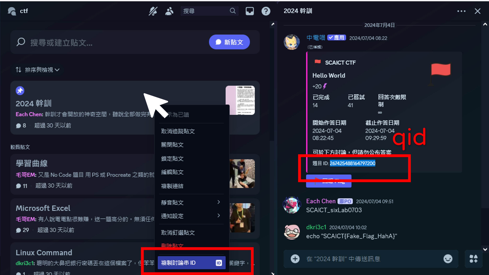

## 創建一道題目
- 限制使用權限：true
  - 允許使用的身分組：ctf 出題者

> ```/create create {title:str} {flag:str} {score:int} [limit:int] [case:bool] [start:YY-MM-DD HH:MM:SS] [end:YY-MM-DD HH:MM:SS]```
- title：題目標題
- flag ：該題解答，格式建議為 ```SCAICT{falg_string}```
- score：解題後能獲得的電電點數量，現在只能選擇贈送電電點，暫時沒有以抽獎劵作為獎勵的功能
- limit：回答次數限制，未填寫為「無限次」
- case ：輸入的答案是否忽略大小寫相異，大小必須吻合為 false；忽略大小寫差異為 true。預設值為 fasle，大小寫必須完全一致
- start：開始時間，預設值為指令發送當下
- end：結束時間，預設永不結束

## 刪除一道題目
- 限制使用權限：true
  - 允許使用的身分組：ctf 出題者
>```/ctf delete {qid} {channel_id} {key}```
- qid：每道 ctf 的唯一 ID ，會顯示在該題目的下方
- channel_id：該題目的題目敘述和按鈕存在的頻道，如果題目在討論串發布，需要在討論串列表右鍵點選「複製討論串 ID」
- key ：欲刪除題目的 flag，這是防呆保護，出題者應該知道自己的 flag


> 如何拿到刪除 CTF 需要的參數