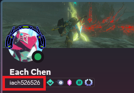

# /dm_gift

- 限制使用權限：true
  - 管理者限定
- 操作資料庫：true
  - RW
## 指令
> ```dm_gift {target_str...} {電電點 | 抽獎券} {贈送物品數量}```

## 描述
這個指令可以選擇多個使用者統一發送相同數量的電電點或抽獎券，第一個參數 ```target_str``` 要填入 Discord 使用者名稱，**不是**顯示名稱。下圖框選起來的部分才是使用者名稱

