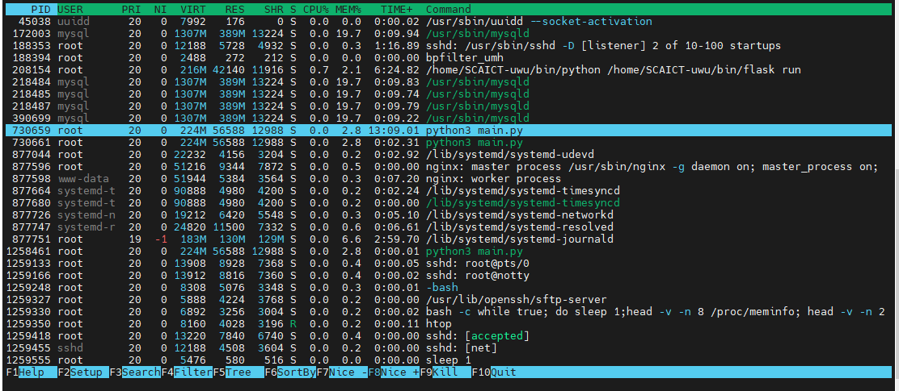

# 維護、部署注意事項

現在看到這裡代表你已經準備好成為一個稱職的中電喵飼養員了，中電喵現在是一隻獨立的貓咪，如果你要出遠門的話至少一個月回來看他一次，並教他新的數數方式打發時間看度過失眠的夜晚．．．．．．。

## 如何在伺服器上長時間運作？

若在伺服器上的專案資料夾執行 "python main.py" 這個指令只會在 ssh 連線階段執行這個工作，這適合短時間的測試，斷開終端機後服務就會關閉。所以要在啟動指令前加上 ***nohop*** 讓工作可以在背景持續執行。此時程式所有的 print 或 error 回報預設會在該專案目錄下面的 nohup.out ，想要變更儲存位置和檔名可以使用管道符號。

利用管道符號把程式輸出存在 `/var/log/DiscordBot/` ，並用時間命名

### 執行中電喵本體

```bash
nohup python3 main.py &>/var/log/DiscordBot/Log_$(date +%Y-%m-%dT%H-%M-%S).log&
```

### 中電商店

```bash
nohup flask run &>/var/log/uwuStore/Log_$(date +%Y-%m-%dT%H-%M-%S).log&
```

執行後 CLI 會顯示 Process ID，下面的例子是開啟了一個 Process ID 為 48763 的工作。這個 ID 是唯一的，用來辨別這個運行的工作。每次開啟服務後建議寫在記事本，下次關服務會比較好找到這個服務。

```
[2] 48763
```

## 關閉長時間運作的服務

關閉用 htop 運行中的服務，可以使用：

- ```kill <Process ID>```
- ```htop```找到要關閉的 Process 按下 F9



使用 htop 這個行程管理工具，可以輕鬆的管理主機上運行的服務。

> Tips：在 htop 內可以使用 F6 排序幫助尋找目標 Process ；選取到目標服務後按下 F9 可以 kill 掉它

## 備份資料庫

### mysqldump 指令

定期備份資料庫是一件很重要的事，使用 mysqldump 指令把某個 database 的表格樣式和儲存的資料都儲存到一個 .spl 檔。裡面會存構成目前資料庫需要的指令。

```bash
mysqldump -u [username] -p [database] > backup.sql # 把現在資料庫的內容輸出成 .sql 檔儲存


mysql -u [username] -p [database] < backup.sql     #把 .sql 執行把資料庫插入備份的資料(要先創好資料庫)
```

### 定期備份資料庫

crontab

## 撰寫說明文件

當開發完一個新的指令或更新功能，得在說明文件記錄新的變動，建議先撰寫使用者向的使用說明，再寫技術說明文件。組織語言讓不會使用的人學會之後，對功能的細節也會更清楚，過程中也會想到開發時沒有想到的例外狀況或更多應用情境。

親測有效，整理發送課程身分組的時候就想到其實可以把一直想不到方法實踐的購買特殊身分組用在兌換區。
