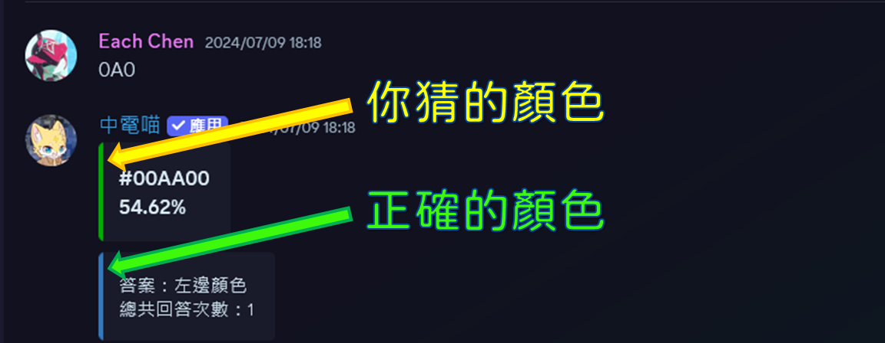
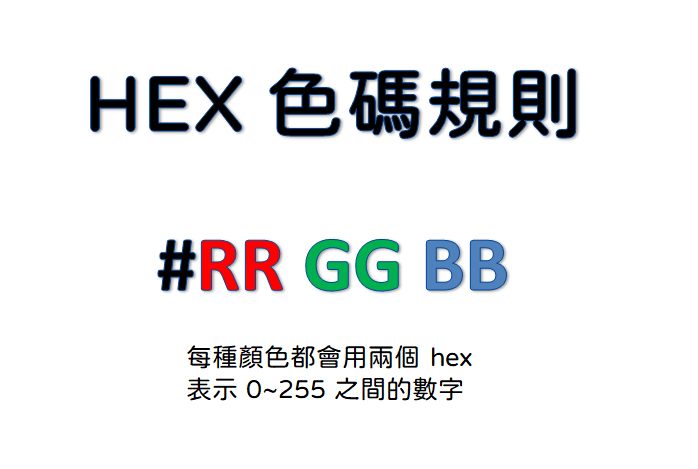

# 🎮遊戲間
import RedText from '@site/src/components/HomepageFeatures/index';

中電喵是一隻好動的貓咪，喜歡和大家玩遊戲，以下是他喜歡玩的遊戲一覽。有空的話就陪他玩一下吧！

## Capture The **Flag** (CTF)

在 /#ctf 討論串中電喵會提出一些小問題考考大家，夠電的你鐵定能秒答。點選**🚩回報Flag 按鈕會彈出 flag 輸入框，注意<RedText>不要把 flag 公開打在文字頻道上</RedText>呦！**

## 數數

睡不著的中電喵喜歡數貓，一隻貓……兩隻貓……三隻貓……Zzzz。

和中電喵一起在 #數數 數貓吧！夠幸運的話睡夢仙子會在枕頭底下放電電點。

## 非常好色

在 #非常好色 頻道，輸入 3 個 16 進位數字分別代表 RGB，，猜猜中電喵所指顏色的 16 進位色碼，中電喵會提示你離正確答案有多接近。猜中可以獲得電電點

## 剪刀石頭布

使用指令和中電喵猜拳，建議在 #指令區 使用。遊戲會有三種結果

- 勝利，加 5 電電點
- 敗北，扣 5 電電點
- 和局，不發生任何事